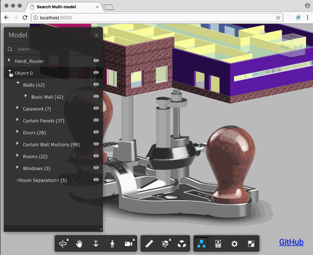

# viewer-multimodel-search
Forge Viewer now supports search across multi-models

Demo: [LIVE SITE](https://wallabyway.github.io/viewer-multimodel-search/)

With the release of version 4.0 of the Viewer, you can now use the model browser to search across multiple models.

This is a quick demo, showing how to load two models, hand-saw and a building-first-floor.  When loading, I set the transform matrix to both scale down the size of the building and shift it above the handsaw.

Now, with the scene in place, click on the model-browser and search for ‘bas’, you will now see search results across both models: "basic wall" from the building, and "BasePlate1" from the HandSaw design.   

Similarly, you can set visibility, highlights and ghosting across multiple models, correctly.
Before, only the results from the first model would work.  

There are still some quirks with ground reflection and shadows.

